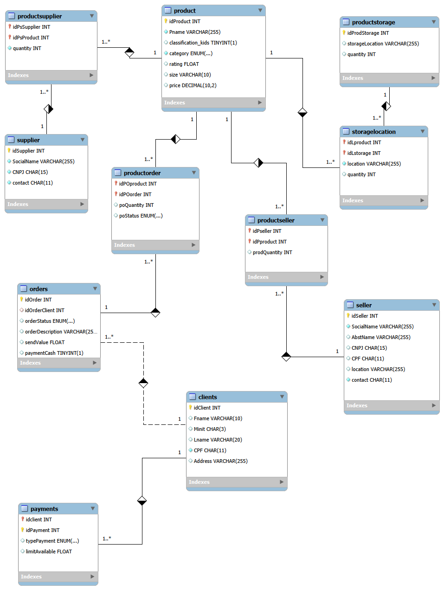

# 🛒 E-commerce Database — Modelagem e Script SQL

Modelagem relacional e script de criação de um banco de dados MySQL para um cenário de **e-commerce**, cobrindo clientes, produtos, pedidos, pagamentos, fornecedores, vendedores terceiros (marketplace) e controle de estoque.

Projeto desenvolvido como desafio de modelagem de dados, evoluído e revisado (bugs corrigidos, tipos de dado ajustados e modelagem de estoque refinada) até chegar num script validado ponta a ponta em MySQL/MariaDB.

---

## 📋 Sumário

- [Visão Geral](#-visão-geral)
- [Diagrama Relacional](#-diagrama-relacional)
- [Tecnologias](#-tecnologias)
- [Estrutura do Banco de Dados](#-estrutura-do-banco-de-dados)
- [Relacionamentos](#-relacionamentos)
- [Como Usar](#-como-usar)
- [Dados de Exemplo e Queries](#-dados-de-exemplo-e-queries)
- [Estrutura do Repositório](#-estrutura-do-repositório)
- [Autor](#-autor)
- [Licença](#-licença)

---

## 🎯 Visão Geral

O projeto modela o banco de dados de uma plataforma de e-commerce, cobrindo:

- 👤 Cadastro de **clientes** e seus **métodos de pagamento**
- 📦 Catálogo de **produtos** (categoria, avaliação, preço, dimensões)
- 🧾 **Pedidos** e itens de pedido
- 🏭 **Fornecedores** de produtos
- 🤝 **Vendedores terceiros** (marketplace) e os produtos que cada um vende
- 🗺️ **Estoque**, com quantidade rastreada por produto e por local

O banco final (`ecommerce`) tem **11 tabelas** e roda em MySQL 5.7+ / MariaDB 10.3+.

---

## 🗂️ Diagrama Relacional



*Diagrama gerado via Reverse Engineer do MySQL Workbench a partir do banco já com todas as correções aplicadas — reflete exatamente o schema criado pelo `esquema_relacional.sql`.*

---

## 🛠️ Tecnologias

| Tecnologia | Descrição |
|-----------|-----------|
| **MySQL / MariaDB** | SGBD relacional alvo do script (`ENUM`, `AUTO_INCREMENT`, `FOREIGN KEY`) |
| **MySQL Workbench** | Modelagem visual do diagrama EER |
| **SQL** | DDL para criação das tabelas e DML para inserção de dados e queries de análise |

---

## 📑 Estrutura do Banco de Dados

### `clients` — Clientes
```sql
create table clients(
  idClient int auto_increment primary key,
  Fname varchar(10),
  Minit char(3),
  Lname varchar(20),
  CPF char(11) not null,
  Address varchar(255),
  constraint unique_cpf_client unique (CPF)
);
```

### `product` — Produtos
```sql
create table product(
  idProduct int auto_increment primary key,
  Pname varchar(255) not null,
  classification_kids bool default false,
  category enum('Eletrônico','Vestimenta','Brinquedos','Alimentos','Móveis') not null,
  rating float default 0,
  size varchar(10),
  Preco decimal(10,2) default 0
);
```

### `payments` — Pagamentos
```sql
create table payments(
  idClient int,
  idPayment int,
  typePayment enum('Boleto','Cartão','Dois cartões'),
  limitAvailable float,
  primary key(idClient, idPayment),
  constraint fk_payments_client foreign key (idClient) references clients(idClient)
    on update cascade
);
```

### `orders` — Pedidos
```sql
create table orders(
  idOrder int auto_increment primary key,
  idOrderClient int,
  orderStatus enum('Cancelado','Confirmado','Em processamento') default 'Em processamento',
  orderDescription varchar(255),
  sendValue float default 10,
  paymentCash boolean default false,
  constraint fk_orders_client foreign key (idOrderClient) references clients(idClient)
    on update cascade
);
```

### `productStorage` — Estoque (locais)
```sql
create table productStorage(
  idProdStorage int auto_increment primary key,
  storageLocation varchar(255),
  quantity int default 0   -- total/capacidade geral do local
);
```

### `supplier` — Fornecedor
```sql
create table supplier(
  idSupplier int auto_increment primary key,
  SocialName varchar(255) not null,
  CNPJ char(15) not null,
  contact char(11) not null,
  constraint unique_supplier unique (CNPJ)
);
```

### `seller` — Vendedor Terceiro
```sql
create table seller(
  idSeller int auto_increment primary key,
  SocialName varchar(255) not null,
  AbstName varchar(255),
  CNPJ char(15),
  CPF char(11),
  location varchar(255),
  contact char(11) not null,
  constraint unique_cnpj_seller unique (CNPJ),
  constraint unique_cpf_seller unique (CPF)
);
```

### Tabelas associativas (N:N)

| Tabela | Relaciona | Descrição |
|--------|-----------|-----------|
| `productSeller` | `seller` ↔ `product` | Produtos vendidos por cada vendedor terceiro, com `prodQuantity` |
| `productOrder` | `product` ↔ `orders` | Itens de um pedido, com `poQuantity` e `poStatus` |
| `storageLocation` | `product` ↔ `productStorage` | Quantidade de **cada produto** em **cada local** de estoque (`quantity`) |
| `productSupplier` | `supplier` ↔ `product` | Produtos fornecidos por cada fornecedor, com quantidade |

---

## 🔗 Relacionamentos

```
clients (1) ──→ (N) orders
clients (1) ──→ (N) payments

orders (1) ──→ (N) productOrder ──→ (N) product

product (1) ──→ (N) productSeller ──→ (N) seller
product (1) ──→ (N) productSupplier ──→ (N) supplier
product (1) ──→ (N) storageLocation ──→ (N) productStorage
```

### Cardinalidades

- **1:N** — Um cliente para múltiplos pedidos e múltiplos métodos de pagamento
- **N:N** — Produto ↔ Pedido, Produto ↔ Vendedor, Produto ↔ Fornecedor, Produto ↔ Estoque

---

## 🚀 Como Usar

### 📥 Pré-requisitos

- MySQL Server 5.7+ ou MariaDB 10.3+
- Um cliente SQL (MySQL Workbench, DBeaver, linha de comando, etc.)

### 📖 Passos

1. **Execute o script de criação do esquema** (idempotente — pode rodar quantas vezes quiser, ele recria o banco do zero):
   ```bash
   mysql -u root -p < esquema_relacional.sql
   ```

2. **Popule o banco e explore as queries de exemplo:**
   ```bash
   mysql -u root -p < queries_and_data_insertion.sql
   ```
   > ℹ️ Esse script também é idempotente — ele limpa (`TRUNCATE`) as tabelas antes de inserir, então pode ser rodado sozinho quantas vezes quiser, sem precisar recriar o schema antes.

3. No **MySQL Workbench**, use `Database → Reverse Engineer` apontando pro schema `ecommerce` pra gerar/atualizar o diagrama EER a partir do banco real.

---

## 💡 Dados de Exemplo e Queries

O arquivo `queries_and_data_insertion.sql` inclui inserções de exemplo (clientes, produtos com preço, pedidos, pagamentos, fornecedores, vendedores e estoque por local) e consultas de análise, como:

**Pedidos por cliente:**
```sql
select c.idClient, Fname, count(*) as Number_of_orders
from clients c
inner join orders o ON c.idClient = o.idOrderClient
group by idClient;
```

**Cliente e status do pedido:**
```sql
select concat(Fname,' ',Lname) as Client, idOrder as Request, orderStatus as Status
from clients c, orders o
where c.idClient = idOrderClient;
```

**Pedidos com produto associado:**
```sql
select * from clients c
inner join orders o ON c.idClient = o.idOrderClient
inner join productOrder p on p.idPOorder = o.idOrder;
```

---

## 📁 Estrutura do Repositório

```
ecommerce-relational-database/
├── README.md                          # Este arquivo
├── diagrama-ecommerce.png             # Diagrama EER (gerado via Reverse Engineer)
├── esquema_relacional.sql             # Script de criação do banco (DDL)
└── queries_and_data_insertion.sql     # Inserção de dados de exemplo e queries
```

---

## 👤 Autor

**Gustavo Sampaio**

- 🎓 Tecnólogo em Gestão da Tecnologia da Informação (GTI)
- 🔐 Pós-graduando em Cybersecurity
- 🔗 [GitHub](https://github.com/guhsilva266)

---

## 📄 Licença

Este projeto está disponível para fins educacionais e de portfólio.
